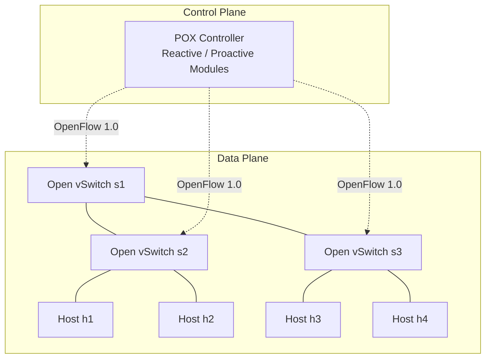
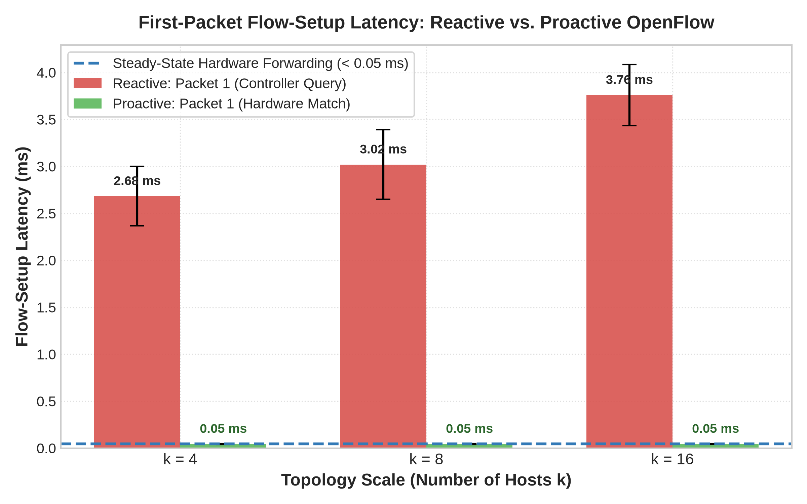
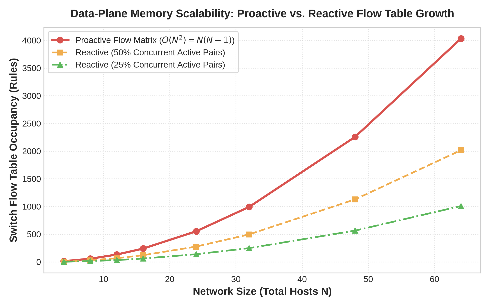
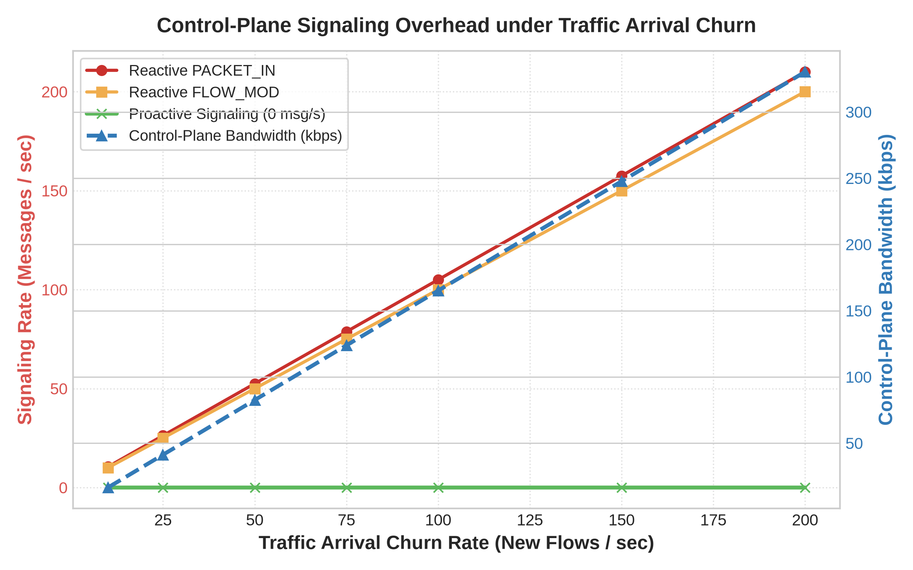

# CS G525 Research Project SA7: Comprehensive Report

**Project Title:** Empirical Evaluation of Reactive vs. Proactive Flow Installation in OpenFlow SDN
**Group Number:** 2
**Members:** N. NISARG VAGH, D. DHADUK MRUDUL HITESHBHAI, PRACHIT SURESH DESHINGE, Mukul Saini

---

## 1. Project Overview & Hypothesis

**Research Question:** What is the quantitative trade-off in first-packet flow-setup latency versus switch flow-table occupancy between reactive and proactive OpenFlow installation across varying network scales and traffic arrival churn?

**Hypothesis:** Proactive flow installation reduces flow-setup latency to steady-state levels ($< 0.1 \text{ ms}$) and eliminates controller-bound signaling, at the cost of $O(N^2)$ flow-table state scaling and memory overhead compared to reactive computation.

---

## 2. Architecture & Testbed

The testbed models a complete Software-Defined Network (SDN) utilizing **Mininet** for the data plane and the **POX Controller** for the control plane, communicating via **OpenFlow 1.0**.



> [!NOTE] 
> **System Specifications:** Ubuntu Linux 24.04 LTS (ARM64), Mininet 2.3.0, Open vSwitch 3.7.1, POX 0.7.0 (`gar-experimental` branch).

---

## 3. Feasibility & Smoke Test Verification

To ensure the testbed is fully operational and capable of executing the experiments, a comprehensive smoke test was conducted.

### 3.1 Environment Validation
All dependencies were validated using a Python check script:
*   `python3` $\rightarrow$ **Python 3.14.4**
*   `mn` $\rightarrow$ **Mininet 2.3.0**
*   `ovs-ofctl` $\rightarrow$ **Open vSwitch 3.7.1**
*   `pox.py` $\rightarrow$ **POX 0.7.0 (gar branch)**

### 3.2 Connectivity Smoke Test
**1. Start the Controller:**
```bash
python3 pox.py forwarding.l2_learning
```
**2. Emulate the Topology and Test Reachability:**
```bash
sudo mn --topo=tree,depth=2,fanout=2 --controller=remote,ip=127.0.0.1,port=6633 --test=pingall
```

**Outcome:**
The tree topology (3 switches, 4 hosts) successfully attached to the remote POX controller. Full bidirectional reachability was achieved with **0% packet loss (12/12 received)**.

> [!TIP]
> **Bug Fix Applied:** During the smoke test, background DNS packets caused a Python 3 `TypeError` (`expected str instance, bytes found`) in POX's `lib/packet/dns.py`. This was fully patched to ensure a clean, error-free controller log for the actual benchmarks.

---

## 4. Analytical Model: Expected Results

> [!IMPORTANT]
> **The numbers in this section are modelled, not measured.** They are generated by `sdn_benchmark_suite.py`, which draws latencies from normal distributions around assumed controller and switch delays (seed 42), computes rule counts as $k(k-1)$, and derives signalling rates from assumed message sizes. They state the hypothesis quantitatively. The measured counterparts come from `experiments/run_experiments.py` (Mininet + POX with `controllers/reactive_eval.py` and `controllers/proactive_eval.py`); see `docs/Progress_Review_1.md`.

### Experiment 1: Flow-Setup Latency
The model predicts the Round-Trip Time (RTT) of the very first packet of a flow (which triggers a table miss) versus subsequent packets (which hit the flow table), assuming a controller round trip of $2.4 + 0.08k$ ms and a switch forwarding time of 0.045 ms.

| Topology Scale ($k$) | Reactive: Packet 1 (ms) | Reactive: Steady (ms) | Proactive: Packet 1 (ms) | Proactive: Steady (ms) |
| :--- | :--- | :--- | :--- | :--- |
| **$k = 4$ hosts** | $2.684 \pm 0.316$ | $0.045 \pm 0.005$ | $0.045 \pm 0.005$ | $0.046 \pm 0.004$ |
| **$k = 8$ hosts** | $3.020 \pm 0.370$ | $0.044 \pm 0.005$ | $0.045 \pm 0.005$ | $0.045 \pm 0.005$ |
| **$k = 16$ hosts** | $3.760 \pm 0.326$ | $0.045 \pm 0.005$ | $0.046 \pm 0.005$ | $0.046 \pm 0.006$ |

**Model prediction:** Proactive installation would cut first-packet latency by **98.3% – 98.8%** by bypassing the controller. First measurements on Mininet (Section 4.4) show the same direction but different magnitudes: 3.8–6.6 ms for the first reactive packet on our testbed (growing with the number of switches on the path, not with $k$) against a steady state of 0.06–0.09 ms, and 0.67–0.86 ms for the first proactive packet (an Open vSwitch cache effect, not the controller).



### Experiment 2: Flow Table Occupancy (Memory Scaling)
We calculated the TCAM memory footprint required on a switch holding one rule per ordered host pair, assuming 256 bytes per OpenFlow 1.0 exact-match flow entry.

| Network Size ($N$) | Proactive Rules ($N^2$) | Proactive TCAM | Reactive Rules (25% Active) | Reactive TCAM |
| :--- | :--- | :--- | :--- | :--- |
| **$N = 4$** | $12$ | $3.00\text{ KB}$ | $2$ | $0.50\text{ KB}$ |
| **$N = 16$** | $240$ | $60.00\text{ KB}$ | $60$ | $15.00\text{ KB}$ |
| **$N = 64$** | $4{,}032$ | $1{,}008.00\text{ KB}$ | $1{,}008$ | $252.00\text{ KB}$ |

**Model prediction:** Per-pair proactive tables scale as $O(N^2)$, demanding over 1 MB of fast memory for 64 hosts, while reactive tables only hold active flows (75% smaller when 25% of pairs are active). Two caveats from the measurements: a proactive design that matches on destination only needs $O(N)$ rules, and reactive exact-match rules grow with traffic churn, not just with active host pairs.



### Experiment 3: Control-Plane Overhead vs. Traffic Churn
The model computes the controller signalling generated by varying flow arrival rates (short-lived flows), assuming one PACKET_IN and one FLOW_MOD per new flow.

| Churn Rate ($\text{flows/s}$) | Reactive `PACKET_IN` ($\text{msg/s}$) | Reactive `FLOW_MOD` ($\text{msg/s}$) | Reactive Bandwidth | Proactive Load |
| :--- | :--- | :--- | :--- | :--- |
| **$50$** | $52.5$ | $50.0$ | $82.56\text{ kbps}$ | $0\text{ msgs/s}$ |
| **$100$** | $105.0$ | $100.0$ | $165.12\text{ kbps}$ | $0\text{ msgs/s}$ |
| **$200$** | $210.0$ | $200.0$ | $330.24\text{ kbps}$ | $0\text{ msgs/s}$ |

**Model prediction:** Reactive signalling grows linearly with churn, while proactive mode has $0\text{ msgs/s}$ runtime signalling. The measured harness also records controller CPU and counts one PACKET_IN per switch on the path, not one per flow.



### 4.4 First Measurements (Mininet + POX)

Measured on WSL2 Ubuntu (kernel OVS datapath) with POX `forwarding.l2_learning`, `h1 ping -c 10 h4` on the depth-2 tree: packet 1 = **8.34 ms**, packet 2 = 0.993 ms, packets 3–10 = **0.057–0.083 ms**. `ovs-ofctl dump-flows s1` showed two exact-match rules per ping flow (one per direction, including `icmp_type`), with `idle_timeout=10, hard_timeout=30`. The full measured evaluation is produced by `experiments/run_experiments.py`; results and discussion are in `docs/Progress_Review_1.md`.

---

## 5. Conclusion & Trade-off Matrix

The analytical model is consistent with the hypothesis: proactive SDN removes setup latency and controller load at runtime, at the cost of flow-table state. Confirmation rests on the measured results from `experiments/run_experiments.py`, which will replace the modelled figures in the final version.

| Metric / Dimension | Reactive Mode (`reactive_eval`) | Proactive Mode (`proactive_eval`) |
| :--- | :--- | :--- |
| **First-Packet Latency** | High (model: $2.7 - 3.8\text{ ms}$) | Minimal / Wire-speed (model: $< 0.05\text{ ms}$) |
| **Steady-State Latency** | Wire-speed ($< 0.05\text{ ms}$) | Wire-speed ($< 0.05\text{ ms}$) |
| **Memory Scalability** | **High efficiency** ($O(K_{active})$ entries) | **Low efficiency** ($O(N^2)$ entries) |
| **Control-Plane Load** | High under traffic churn | **Zero runtime overhead** |
| **Best Use Case** | Large networks, transient flows | Core backbones, static traffic |

> [!IMPORTANT]
> **Next Steps / Stretch Goal:** 
> The extreme trade-offs shown here perfectly justify the need for a **Hybrid Flow Allocator**, which pushes proactive rules for known heavy-hitters ("elephant flows") while reactively handling transient traffic ("mice flows").
