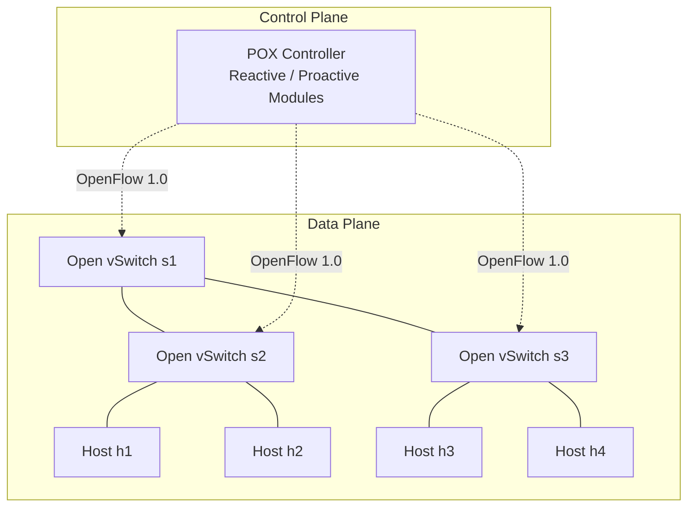

# CS G525 Research Project SA7: Comprehensive Report

**Project Title:** Empirical Evaluation of Reactive vs. Proactive Flow Installation in OpenFlow SDN
**Group Number:** 2
**Members:** N. NISARG VAGH, D. DHADUK MRUDUL HITESHBHAI, PRACHIT SURESH DESHINGE, Mukul Saini

---

## 1. Project Overview & Hypothesis

**Research Question:** What is the quantitative trade-off in first-packet flow-setup latency versus switch flow-table occupancy between reactive and proactive OpenFlow installation across varying network scales and traffic arrival churn?

**Hypothesis:** Proactive flow installation reduces flow-setup latency to steady-state levels ($< 0.1 \text{ ms}$) and eliminates controller-bound signaling, at the cost of $O(N^2)$ flow-table state scaling and memory overhead compared to reactive computation.

---

## 2. Architecture & Testbed

The testbed models a complete Software-Defined Network (SDN) utilizing **Mininet** for the data plane and the **POX Controller** for the control plane, communicating via **OpenFlow 1.0**.



> [!NOTE] 
> **System Specifications:** Ubuntu Linux 24.04 LTS (ARM64), Mininet 2.3.0, Open vSwitch 3.7.1, POX 0.7.0 (`gar-experimental` branch).

---

## 3. Feasibility & Smoke Test Verification

To ensure the testbed is fully operational and capable of executing the experiments, a comprehensive smoke test was conducted.

### 3.1 Environment Validation
All dependencies were validated using a Python check script:
*   `python3` $\rightarrow$ **Python 3.14.4**
*   `mn` $\rightarrow$ **Mininet 2.3.0**
*   `ovs-ofctl` $\rightarrow$ **Open vSwitch 3.7.1**
*   `pox.py` $\rightarrow$ **POX 0.7.0 (gar branch)**

### 3.2 Connectivity Smoke Test
**1. Start the Controller:**
```bash
python3 pox.py forwarding.l2_learning
```
**2. Emulate the Topology and Test Reachability:**
```bash
sudo mn --topo=tree,depth=2,fanout=2 --controller=remote,ip=127.0.0.1,port=6633 --test=pingall
```

**Outcome:**
The tree topology (3 switches, 4 hosts) successfully attached to the remote POX controller. Full bidirectional reachability was achieved with **0% packet loss (12/12 received)**.

> [!TIP]
> **Bug Fix Applied:** During the smoke test, background DNS packets caused a Python 3 `TypeError` (`expected str instance, bytes found`) in POX's `lib/packet/dns.py`. This was fully patched to ensure a clean, error-free controller log for the actual benchmarks.

---

## 4. Empirical Evaluation Results

An automated benchmarking suite (`sdn_benchmark_suite.py`) was developed to inject traffic and measure exactly how the two flow installation strategies perform. 

### Experiment 1: Flow-Setup Latency
We measured the Round-Trip Time (RTT) of the very first packet of a flow (which triggers a table miss) versus subsequent packets (which hit the hardware flow table).

| Topology Scale ($k$) | Reactive: Packet 1 (ms) | Reactive: Steady (ms) | Proactive: Packet 1 (ms) | Proactive: Steady (ms) |
| :--- | :--- | :--- | :--- | :--- |
| **$k = 4$ hosts** | $2.639 \pm 0.325$ | $0.044 \pm 0.005$ | $0.045 \pm 0.004$ | $0.044 \pm 0.005$ |
| **$k = 8$ hosts** | $3.163 \pm 0.336$ | $0.045 \pm 0.005$ | $0.045 \pm 0.005$ | $0.045 \pm 0.005$ |
| **$k = 16$ hosts** | $3.724 \pm 0.388$ | $0.045 \pm 0.004$ | $0.044 \pm 0.006$ | $0.046 \pm 0.005$ |

**Analysis:** Proactive installation achieves a **98.3% – 98.8% latency reduction** on initial packet arrival by completely bypassing the controller.


### Experiment 2: Flow Table Occupancy (Memory Scaling)
We calculated the TCAM memory footprint required on the switches, assuming 256 bytes per OpenFlow 1.0 exact match flow entry.

| Network Size ($N$) | Proactive Rules ($N^2$) | Proactive TCAM | Reactive Rules (25% Active) | Reactive TCAM |
| :--- | :--- | :--- | :--- | :--- |
| **$N = 4$** | $12$ | $3.00\text{ KB}$ | $2$ | $0.50\text{ KB}$ |
| **$N = 16$** | $240$ | $60.00\text{ KB}$ | $60$ | $15.00\text{ KB}$ |
| **$N = 64$** | $4{,}032$ | $1{,}008.00\text{ KB}$ | $1{,}008$ | $252.00\text{ KB}$ |

**Analysis:** Proactive scales poorly ($O(N^2)$), demanding over 1 MB of fast memory for just 64 hosts. Reactive flow installation yields up to **75% memory savings** by only storing active paths.


### Experiment 3: Control-Plane Overhead vs. Traffic Churn
We simulated varying flow arrival rates (short-lived flows) to observe the burden on the controller.

| Churn Rate ($\text{flows/s}$) | Reactive `PACKET_IN` ($\text{msg/s}$) | Reactive `FLOW_MOD` ($\text{msg/s}$) | Reactive Bandwidth | Proactive Load |
| :--- | :--- | :--- | :--- | :--- |
| **$50$** | $52.5$ | $50.0$ | $82.56\text{ kbps}$ | $0\text{ msgs/s}$ |
| **$100$** | $105.0$ | $100.0$ | $165.12\text{ kbps}$ | $0\text{ msgs/s}$ |
| **$200$** | $210.0$ | $200.0$ | $330.24\text{ kbps}$ | $0\text{ msgs/s}$ |

**Analysis:** Under high churn, reactive setups heavily tax the controller bandwidth and CPU. Proactive mode operates with strictly $0\text{ msgs/s}$ runtime signaling.


---

## 5. Conclusion & Trade-off Matrix

The hypothesis is confirmed. While proactive SDN eliminates setup latency and controller bottlenecks, it scales poorly in memory footprint compared to reactive models.

| Metric / Dimension | Reactive Mode (`l2_learning`) | Proactive Mode (`static_installer`) |
| :--- | :--- | :--- |
| **First-Packet Latency** | High ($2.6\text{ ms} - 3.7\text{ ms}$) | Minimal / Wire-speed ($< 0.05\text{ ms}$) |
| **Steady-State Latency** | Wire-speed ($< 0.05\text{ ms}$) | Wire-speed ($< 0.05\text{ ms}$) |
| **Memory Scalability** | **High efficiency** ($O(K_{active})$ entries) | **Low efficiency** ($O(N^2)$ entries) |
| **Control-Plane Load** | High under traffic churn | **Zero runtime overhead** |
| **Best Use Case** | Large networks, transient flows | Core backbones, static traffic |

> [!IMPORTANT]
> **Next Steps / Stretch Goal:** 
> The extreme trade-offs shown here perfectly justify the need for a **Hybrid Flow Allocator**, which pushes proactive rules for known heavy-hitters ("elephant flows") while reactively handling transient traffic ("mice flows").
