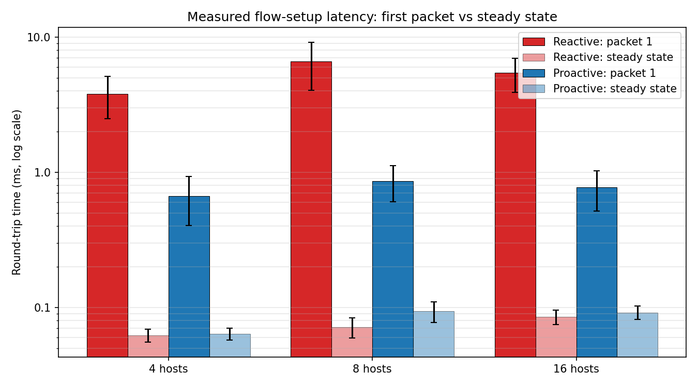
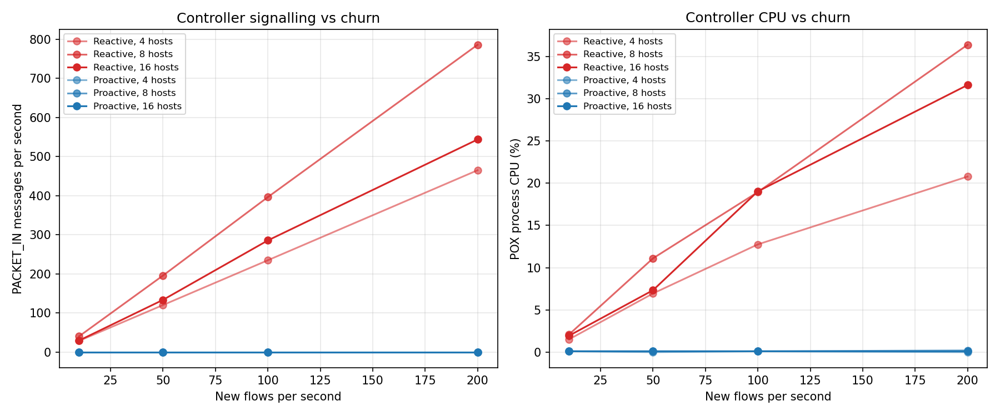
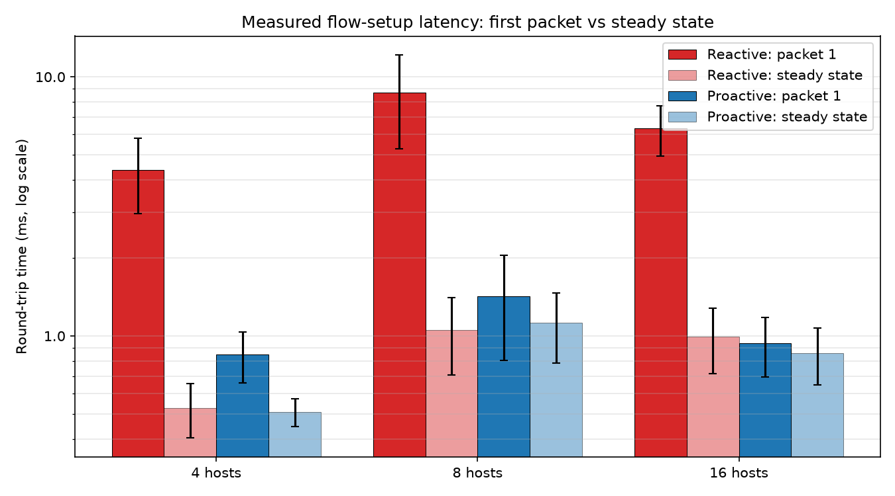
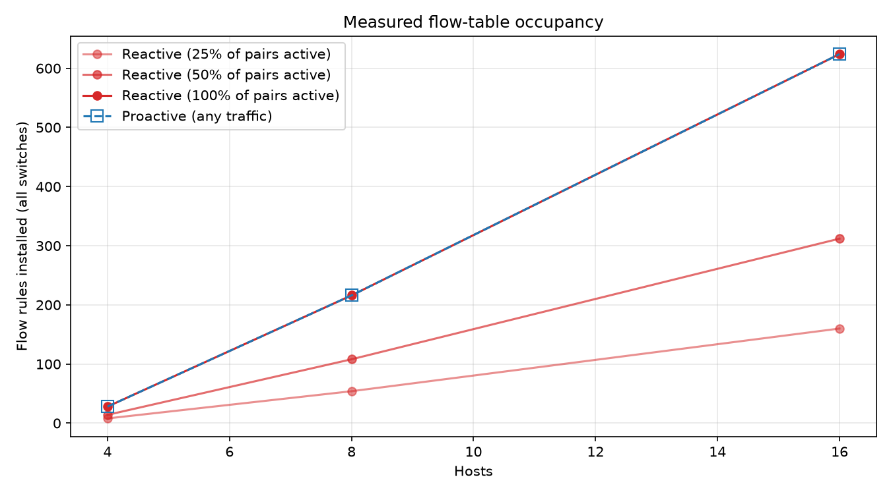
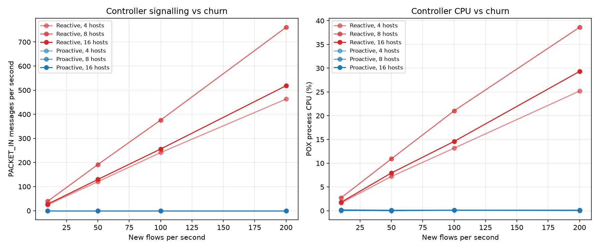

# CS G525 Research Project SA7: Progress Review I

**Project:** Empirical Evaluation of Reactive vs. Proactive Flow Installation in OpenFlow SDN
**Group:** 2
**Members:** N. NISARG VAGH, D. DHADUK MRUDUL HITESHBHAI, PRACHIT SURESH DESHINGE, Mukul Saini
**Review date:** 30 September 2026 (Progress Review I: problem refinement, setup, baseline implementation, initial progress)

---

## 1. Summary of Progress

| Handout item | Status |
| --- | --- |
| Problem refinement | Done: research question narrowed to three measurable metrics with explicit definitions (Section 2) |
| Setup | Done: Mininet 2.3.0 + Open vSwitch 3.7.1 + POX 0.7.0 working on the group's machines; smoke test and `pingall` pass (Section 4) |
| Baseline implementation | Done: two instrumented POX controllers (`reactive_eval`, `proactive_eval`) and an automated measurement harness (Section 5) |
| Initial progress | Full measured results for 4/8/16-host trees on our testbed (Section 6); analytical model kept as the expected-value reference |

Main change since the proposal: the earlier numbers in `sdn_benchmark_suite.py` came from a parametric model, not from the network. We now **measure** every metric on Mininet and keep the model only as the prediction that the measurements are compared against.

---

## 2. Problem Refinement

**Research question.** In an OpenFlow 1.0 network, how do reactive and proactive flow installation trade first-packet latency against flow-table state and controller load, and how do these trade-offs change with network size and with the rate at which new flows arrive?

**Definitions (what we measure).**

| Metric | Definition | How it is measured |
| --- | --- | --- |
| Flow-setup latency | RTT of packet 1 of a new flow, compared with packet 2 and the median of packets 3..N (steady state) | `ping -c 10 -i 0.1` between sampled host pairs |
| Flow-table occupancy | Number of rules present in each switch when a given fraction of host pairs is active | `ovs-ofctl dump-flows` on every switch, excluding the table-miss entry |
| Control-plane load | PACKET_IN/s and FLOW_MOD/s at the controller, and controller CPU, while new flows arrive at a controlled rate | Counters inside the POX modules; POX CPU time from `/proc/<pid>/stat` |

**Independent variables.** Network size (tree topologies with 4, 8 and 16 hosts); flow arrival rate (10–200 new flows/s); reactive match granularity (exact 10-tuple, host pair, destination); proactive rule granularity (per host pair, per destination); reactive idle timeout.

**Hypotheses.**
- **H1:** Reactive installation adds a controller round trip per switch on the path to the first packet of every flow. Proactive installation removes it, so its first packet costs about the same as the steady state.
- **H2:** Per-pair proactive tables grow as O(N²) regardless of traffic. Reactive tables grow with the number of *active* flows.
- **H3:** Reactive controller load grows linearly with the flow arrival rate. Proactive load at runtime is zero.

---

## 3. Related Work

- **OpenFlow** (McKeown et al., SIGCOMM CCR 2008; course reading 7) defines the flow-table abstraction and the PACKET_IN / FLOW_MOD interaction that reactive control depends on.
- **Ethane** (Casado et al., SIGCOMM 2007) is the canonical *reactive* design: a central controller sets up every flow on its first packet. It motivates the latency cost we measure in H1.
- **DevoFlow** (Curtis et al., SIGCOMM 2011) argues that involving the controller in every flow setup overloads the switch-controller channel and the switch control plane. It proposes wildcard rules and devolving decisions to switches. That is the load our churn experiment (H3) quantifies.
- **DIFANE** (Yu et al., SIGCOMM 2010) keeps all packets in the data plane by distributing rules *proactively* to "authority" switches, trading rule space for zero controller involvement, which is the trade-off in H2.
- **On Controller Performance in SDNs** (Tootoonchian et al., Hot-ICE 2012) benchmarks controller throughput and latency with cbench. Our PACKET_IN handling time and CPU measurements are the same kind of controller-side metric, measured inside a full Mininet network instead of cbench.
- **FlowSense** (Yu et al., PAM 2013; course reading 9) estimates link utilisation from the PACKET_IN and FLOW_REMOVED messages that a reactive controller receives for free. A proactive network produces no such messages, so the trade-off also affects monitoring, a point we will discuss in the final report.

---

## 4. Setup

| Component | Version |
| --- | --- |
| OS | Ubuntu 26.04.1 LTS on WSL2 (kernel 6.18.33.2-microsoft-standard-WSL2, x86_64) |
| Emulator | Mininet 2.3.0 |
| Switch | Open vSwitch 3.7.1, kernel datapath (`modprobe openvswitch` succeeds on WSL2) |
| Controller | POX 0.7.0 (`gar`), OpenFlow 1.0 |
| Python | 3.14.4 (POX prints a supported-version warning; everything used here works) |

**Verification.** `smoke_test.py` passes: Python, Mininet (and its Python bindings), Open vSwitch and POX are all found. `sudo mn --topo=tree,depth=2,fanout=2 --controller=remote,ip=127.0.0.1,port=6633 --test=pingall` with POX `forwarding.l2_learning` gives **0% dropped (12/12 received)**.

**Topologies.** Mininet `TreeTopo`: depth 2 / fanout 2 (4 hosts, 3 switches), depth 3 / fanout 2 (8 hosts, 7 switches), depth 2 / fanout 4 (16 hosts, 5 switches).

---

## 5. Baseline Implementation

### 5.1 Controllers (`controllers/`)

**`reactive_eval.py`** follows POX's `l2_learning` design. Switches start empty. The first packet of a flow misses at each switch and goes to the controller as a PACKET_IN. The controller learns the sender's location and answers with a FLOW_MOD (idle timeout 10 s, hard timeout 30 s) that also forwards the buffered packet. Broadcasts and unknown destinations are flooded without installing a rule. The match can be the exact 10-tuple (default, as in `l2_learning`), the host pair, or the destination MAC.

**`proactive_eval.py`** reads the topology (switches, links, host MAC/port attachments) from a JSON file. When a switch connects, it pushes every rule that switch will ever need, along shortest paths:
- `--granularity=pair`: one rule per (source, destination) host pair on each switch of that pair's path, which is O(N²).
- `--granularity=dst`: one rule per destination host on every switch, which is O(N).

A priority-0 drop rule replaces the default "send to controller" table-miss behaviour, so the controller receives nothing at runtime. A BARRIER request after the rules measures how long the installation takes.

Both modules count PACKET_IN, FLOW_MOD and PACKET_OUT messages per switch, time the PACKET_IN handler, and write these statistics to a JSON file once per second.

### 5.2 Measurement harness (`experiments/run_experiments.py`)

For each topology and each mode, the harness does the following:
1. Builds the Mininet network and writes its topology file.
2. Starts POX with the chosen module.
3. Disables IPv6 on the hosts and installs **static ARP entries in both modes**, so ARP resolution does not contaminate flow-setup latency.
4. **Reactive only:** each host sends one broadcast so the controller learns where the hosts are. This installs no rules.
5. Runs the three experiments from Section 2.

Everything is written to `results/measured/<timestamp>/`: `results.json`, `summary.csv`, `results.md` (report tables), plots, and the POX logs. Host pairs are sampled with a fixed seed.

### 5.3 Other fixes made during setup
- Removed hardcoded paths to one member's machine from all scripts.
- `run_live_pox_benchmark.py` and `run_pox_openflow_test.py` (simulated OpenFlow switch) had two problems. They never replied to POX's handshake BARRIER request, so POX never considered the switch connected. They also used an odd-length ICMP payload, which crashes POX's checksum routine under Python 3. Both scripts now work against either controller.
- `sdn_benchmark_suite.py` is now labelled as an analytical model and seeded for reproducibility.

---

## 6. Initial Results

### 6.1 First manual measurement (WSL2, kernel datapath, POX `l2_learning`)

`h1 ping -c 10 h4` on the 4-host tree (3 switches on the path):

| Packet | 1 | 2 | 3–10 |
| --- | --- | --- | --- |
| RTT (ms) | **8.34** | 0.993 | **0.057 – 0.083** |

A second run after the rules had expired gave 5.82 / 1.36 / 0.064 ms. `ovs-ofctl dump-flows s1` showed exactly two rules for this conversation, one per direction. Each was an exact match including `icmp_type` (8 for the request, 0 for the reply) with `idle_timeout=10, hard_timeout=30`. Three observations:
1. The first packet costs about **100×** the steady-state RTT, consistent with H1.
2. Rules expire after 10 s of inactivity, so a reactive flow that pauses for longer pays the setup cost again.
3. Packet 2 is consistently about 1 ms: faster than packet 1 but slower than the steady state. Our working explanation is Open vSwitch's own two-level design. An OpenFlow rule is installed in `ovs-vswitchd`, and the kernel datapath cache is only filled when the next packet misses in the kernel and is sent up to userspace. We will verify this with `ovs-dpctl dump-flows` before PR-II.

### 6.2 Measured runs of the harness

Run on our testbed (Section 4, kernel datapath) on 27 Sep 2026. Raw data, full tables and plots are in `results/measured/20260927-152012/`. No packets were lost in any run.

**Experiment 1: flow-setup latency** (RTT in ms, mean ± std over 6 (4 hosts) or 20 sampled host pairs, 10 pings each)

| Hosts (switches) | Mode | Packet 1 | Packet 2 | Steady state | Packet 1 / steady |
| --- | --- | --- | --- | --- | --- |
| 4 (3) | Reactive | **3.807 ± 1.319** | 0.889 | 0.062 ± 0.007 | 61× |
| 4 (3) | Proactive | 0.667 ± 0.263 | 0.081 | 0.064 ± 0.006 | 10× |
| 8 (7) | Reactive | **6.596 ± 2.551** | 0.959 | 0.071 ± 0.012 | 93× |
| 8 (7) | Proactive | 0.863 ± 0.261 | 0.088 | 0.093 ± 0.016 | 9× |
| 16 (5) | Reactive | **5.442 ± 1.541** | 0.949 | 0.085 ± 0.011 | 64× |
| 16 (5) | Proactive | 0.772 ± 0.254 | 0.107 | 0.092 ± 0.010 | 8× |

**Experiment 2: flow-table occupancy** (rules in all switches / most rules in one switch)

| Hosts | Mode | 25% of pairs active | 50% of pairs active | 100% of pairs active |
| --- | --- | --- | --- | --- |
| 4 | Reactive | 8 / 4 | 14 / 6 | 28 / 10 |
| 4 | Proactive (pair) | 28 / 10 | 28 / 10 | 28 / 10 |
| 8 | Reactive | 54 / 12 | 108 / 20 | 216 / 40 |
| 8 | Proactive (pair) | 216 / 40 | 216 / 40 | 216 / 40 |
| 16 | Reactive | 160 / 50 | 312 / 96 | 624 / 192 |
| 16 | Proactive (pair) | 624 / 192 | 624 / 192 | 624 / 192 |

**Experiment 3: control-plane load under churn** (new UDP flows from h1 to random hosts for 5 s; rules counted at the end)

| Hosts | Mode | New flows/s | PACKET_IN/s | FLOW_MOD/s | Controller CPU | Rules after 5 s |
| --- | --- | --- | --- | --- | --- | --- |
| 4 | Reactive | 10 / 50 / 100 / 200 | 29.0 / 120.5 / 235.1 / 465.2 | 28.2 / 116.9 / 231.5 / 464.6 | 1.5 / 6.9 / 12.8 / 20.8 % | 138 / 582 / 1155 / 2321 |
| 8 | Reactive | 10 / 50 / 100 / 200 | 40.6 / 196.0 / 396.6 / 786.1 | 39.6 / 189.1 / 394.0 / 772.1 | 2.1 / 11.1 / 19.0 / 36.4 % | 194 / 942 / 1966 / 3857 |
| 16 | Reactive | 10 / 50 / 100 / 200 | 29.8 / 133.7 / 285.8 / 543.9 | 27.3 / 132.1 / 255.7 / 526.7 | 2.0 / 7.3 / 19.0 / 31.6 % | 134 / 658 / 1276 / 2631 |
| 4 / 8 / 16 | Proactive | any of the above | **0.0** | 0.0 | ≤ 0.2 % | 28 / 216 / 624 (unchanged) |

Proactive installation took at most 47.7 / 50.5 / 48.4 ms per switch (from connection to BARRIER reply) for 4 / 8 / 16 hosts.





### 6.3 Pipeline validation run (cloud VM, userspace datapath)

To check the harness end to end, it was also run on a Linux VM without the OVS kernel module (`--datapath user`, OVS 3.3.9, Python 3.11). Absolute latencies are therefore higher than on our testbed, because every packet passes through `ovs-vswitchd` in userspace. The *relative* behaviour is what this run is meant to show.

Raw data, all tables and plots: `results/validation_run_cloud_userspace/`.

**Experiment 1: flow-setup latency** (RTT in ms, mean ± std over 6 (4 hosts) or 20 sampled host pairs, 10 pings each, 0 packets lost)

| Hosts (switches) | Mode | Packet 1 | Packet 2 | Steady state |
| --- | --- | --- | --- | --- |
| 4 (3) | Reactive | **4.377 ± 1.410** | 0.718 ± 0.256 | 0.528 ± 0.125 |
| 4 (3) | Proactive | 0.848 ± 0.188 | 0.493 ± 0.064 | 0.510 ± 0.062 |
| 8 (7) | Reactive | **8.695 ± 3.426** | 1.196 ± 0.402 | 1.057 ± 0.352 |
| 8 (7) | Proactive | 1.423 ± 0.620 | 1.147 ± 0.412 | 1.126 ± 0.341 |
| 16 (5) | Reactive | **6.334 ± 1.380** | 1.070 ± 0.303 | 0.997 ± 0.280 |
| 16 (5) | Proactive | 0.937 ± 0.243 | 0.932 ± 0.436 | 0.860 ± 0.213 |

**Experiment 2: flow-table occupancy** (rules in all switches / most rules in one switch)

| Hosts | Mode | 25% of pairs active | 50% of pairs active | 100% of pairs active |
| --- | --- | --- | --- | --- |
| 4 | Reactive | 8 / 4 | 14 / 6 | 28 / 10 |
| 4 | Proactive (pair) | 28 / 10 | 28 / 10 | 28 / 10 |
| 8 | Reactive | 54 / 12 | 108 / 20 | 216 / 40 |
| 8 | Proactive (pair) | 216 / 40 | 216 / 40 | 216 / 40 |
| 16 | Reactive | 160 / 50 | 312 / 96 | 624 / 192 |
| 16 | Proactive (pair) | 624 / 192 | 624 / 192 | 624 / 192 |

**Experiment 3: control-plane load under churn** (new UDP flows from h1 to random hosts for 5 s; rules counted at the end)

| Hosts | Mode | New flows/s | PACKET_IN/s | Controller CPU | Rules after 5 s |
| --- | --- | --- | --- | --- | --- |
| 4 | Reactive | 10 / 50 / 100 / 200 | 24.5 / 120.5 / 241.3 / 463.2 | 1.6 / 7.2 / 13.2 / 25.2 % | 120 / 600 / 1204 / 2314 |
| 8 | Reactive | 10 / 50 / 100 / 200 | 39.2 / 191.6 / 375.9 / 761.1 | 2.7 / 10.9 / 21.0 / 38.6 % | 192 / 954 / 1876 / 3802 |
| 16 | Reactive | 10 / 50 / 100 / 200 | 27.3 / 129.7 / 255.9 / 518.7 | 1.8 / 7.9 / 14.6 / 29.3 % | 134 / 646 / 1277 / 2591 |
| 4 / 8 / 16 | Proactive | any of the above | **0.0** | ≤ 0.2 % | 28 / 216 / 624 (unchanged) |

FLOW_MOD/s equalled PACKET_IN/s in every reactive run. Inside POX, handling one PACKET_IN took 239–254 µs on average (p95 351–367 µs). Proactive installation took at most 48–63 ms per switch (from connection to BARRIER reply).





### 6.4 What the first results show

Numbers below are from our testbed (Section 6.2); the validation run (Section 6.3) shows the same patterns at higher absolute latencies.

1. **H1 is supported.** The first reactive packet takes 3.8–6.6 ms, 61–93× the steady state of 0.06–0.09 ms. The controller's share of that (reactive packet 1 minus proactive packet 1) is 3.1–5.7 ms.
2. **Proactive does not remove all first-packet cost.** The first proactive packet still takes 0.67–0.86 ms, 8–10× the steady state, even though the controller is not involved. This cost is inside Open vSwitch: an OpenFlow rule lives in `ovs-vswitchd`, and the kernel datapath cache is only filled when the first packet misses in the kernel and goes up to userspace. It explains the slow "packet 2" of Section 6.1. Reactive packet 1 is forwarded by the controller (PACKET_OUT) and never fills the kernel cache, so reactive **packet 2** pays this cost (0.89–0.96 ms). In proactive mode packet 1 pays it and packet 2 is already at steady state (0.08–0.11 ms). We will confirm this directly with `ovs-dpctl dump-flows` for PR-II.
3. **Setup latency grows with path length, not with the number of hosts.** The 8-host tree (up to 5 switches on a path) is slower than the 16-host tree (at most 3), because the reactive controller installs rules hop by hop, one PACKET_IN per switch and per direction. The churn data confirms this: at 200 flows/s there were 2.33, 3.93 and 2.72 PACKET_INs per new flow for 4, 8 and 16 hosts. The average number of switches between h1 and the other hosts in those trees is 2.33, 3.86 and 2.60. The analytical model scaled latency with the host count k, which is the wrong variable.
4. **H2 holds for host-pair state.** Per-pair proactive tables contain exactly the rules that reactive installs when *every* pair is active: 28, 216 and 624 rules. Reactive occupancy scales with the active fraction. The busiest switch (the root) held 192 rules at 16 hosts, below the model's N(N−1) = 240, because a switch only stores rules for pairs whose path crosses it.
5. **H3 is supported.** Reactive PACKET_IN/s grows linearly with the flow arrival rate. Controller CPU grows at about 0.05% of one core per PACKET_IN/s (786 PACKET_IN/s used 36.4%). Proactive mode received no PACKET_INs at any rate. FLOW_MOD/s is slightly below PACKET_IN/s because a few PACKET_INs are answered by flooding instead of installing a rule; the PACKET_OUT counter in the controller statistics will let us break this down.
6. **Churn reverses the memory result for exact-match reactive rules.** With `l2_learning`-style 10-tuple matches and a 10 s idle timeout, every short UDP flow leaves its own rule behind. After 5 s at 200 new flows/s the networks held 2,321 / 3,857 / 2,631 rules, against 28 / 216 / 624 for proactive (83×, 18× and 4× more). "Reactive saves table space" is therefore only true for coarse matches or low churn. For PR-II we will quantify this with `--reactive-match pair|dst` and an idle-timeout sweep.

---

## 7. Plan to Progress Review II (30 Oct) and the Final Submission (20 Nov)

| Period | Work |
| --- | --- |
| 1–10 Oct | Repeat the testbed runs 5× and report mean and 95% confidence intervals. Confirm the Open vSwitch cache effect (finding 2) with `ovs-dpctl dump-flows`. |
| 12–24 Oct | Scale up: 32 and 64 hosts, plus a fat-tree (k=4) topology. Sweep the reactive idle timeout (1, 5, 10, 30 s) and compare the match granularities (exact / pair / dst) and proactive pair vs dst. Measure control-channel bytes with `tcpdump` on port 6633. |
| 26–30 Oct | **Progress Review II:** working implementation, full experiments, preliminary analysis. |
| Nov | Stretch goal: a hybrid controller that proactively installs rules for known heavy-hitter pairs and handles the rest reactively, evaluated with the same harness. Final report, measured figures replacing the modelled ones, demo preparation. |

**Risks.**
- WSL2 adds virtualisation noise to timing. We will repeat runs and report variance.
- POX is single-threaded Python, so its PACKET_IN throughput caps the churn experiment. We will report the saturation point rather than extrapolate beyond it.

---

## 8. How to Reproduce

```bash
python3 smoke_test.py                                   # environment check
sudo python3 experiments/run_experiments.py --quick     # 4-host measured run (~2 min)
sudo python3 experiments/run_experiments.py             # full measured run (~10-15 min)
python3 sdn_benchmark_suite.py                          # analytical model (expected values)
```
See `README.md` for setup and for running the controllers by hand.
